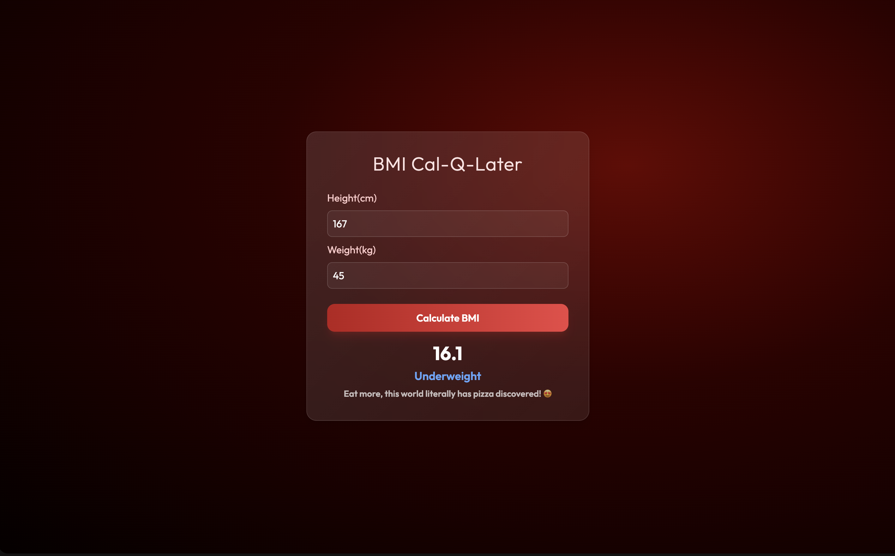
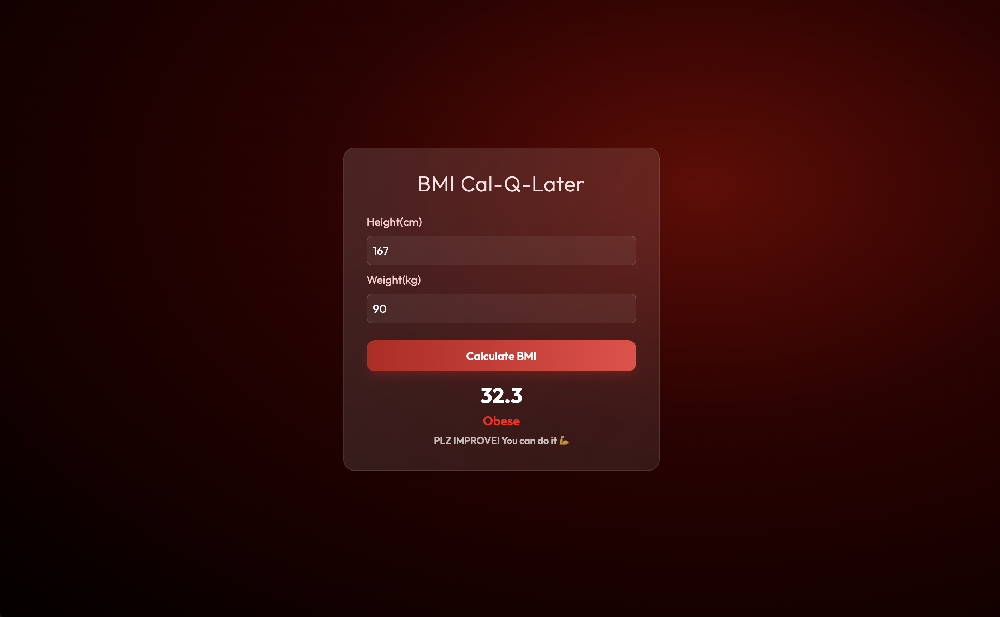

# 🩺 BMI Cal-Q-Later

> **Note:** This is a beginner-level project built purely for hands-on practice and understanding of **DOM Manipulation** in JavaScript. The goal was never to build something fancy — just to get comfortable with how the DOM works. That said, the design happened naturally as the vibe flowed, and it turned out looking pretty good! So think of the UI as a fun side effect, not the main agenda. 😄

---

## 🖼️ Preview




---

## 📖 About

**BMI Cal-Q-Later** is a simple BMI (Body Mass Index) calculator web app built with HTML, Tailwind CSS, and vanilla JavaScript. You enter your height (in cm) and weight (in kg), hit the button, and it tells you your BMI along with which category you fall into — with a little motivational (or savage) message to go with it. 💪

---

## 🎯 What I Learned

This project was all about getting hands-on with the **DOM** and core web fundamentals. Here's what I practiced:

- **DOM Selection** — using `document.getElementById` to grab elements
- **Event Listeners** — attaching `addEventListener('click', ...)` to buttons
- **Reading Input Values** — using `.value` to get what the user typed
- **Manipulating the DOM** — using `innerText` and `innerHTML` to display results dynamically
- **Template Literals** — using backticks and `${}` to build dynamic HTML strings
- **Type Conversion** — understanding why `.toFixed()` returns a string and using `parseFloat()` to convert back
- **Conditional Logic** — writing `if/else` chains to categorize BMI values
- **Input Validation** — checking for empty inputs and using `return` to stop execution early
- **Boolean Flags & Variables** — storing state like `category`, `color`, and `message` across logic
- **CSS + Tailwind** — using utility classes and custom CSS together without conflict
- **Glassmorphism UI** — using `backdrop-filter`, asymmetric borders, and gradients for a premium look
- **Google Fonts** — linking and applying custom fonts via `@import`
- **Favicon Setup** — linking multiple favicon sizes for browser tab and mobile support

---

## ✨ Features

- 🧮 Accurate BMI calculation using the standard formula
- 🎨 Crimson dark glassmorphism UI
- 🌈 Color-coded results (blue / green / orange / red)
- 💬 Fun personalized message for each BMI category
- 🚫 Empty input validation with alert
- 🔢 Clean decimal handling with `.toFixed(1)`
- 📱 Responsive centered layout

---

## 🗂️ Tech Stack

| Technology | Usage |
|---|---|
| HTML | Structure |
| Tailwind CSS (CDN) | Styling & layout |
| Vanilla JavaScript | DOM manipulation & logic |
| Google Fonts (Outfit) | Typography |
| Custom CSS | Glassmorphism, gradients, hover effects |

---

## 🧮 BMI Formula

```
BMI = weight (kg) / height (m)²
```

| BMI Range | Category |
|---|---|
| Below 18.5 | Underweight |
| 18.5 – 24.9 | Normal Weight |
| 25 – 29.9 | Overweight |
| 30 and above | Obese |

---

## 🚀 How to Run

1. Clone the repo:
```bash
git clone https://github.com/EishtKG/BMI_Cal-Q-Later.git
```
2. Open `index.html` in your browser — that's it! No build tools, no installs.

---

## 🎨 Design Note

The design wasn't planned at all — it just happened as the vibe flowed while building! The crimson dark theme, glassmorphism container, gradient button, and Outfit font all came together purely out of enthusiasm. The real goal of this project was DOM practice, and the pretty UI was just a happy accident. 🎉

---

## 👨‍💻 Author

Made with curiosity and a lot of pizza motivation 🍕 by **Eisht Kumar Gupta**
